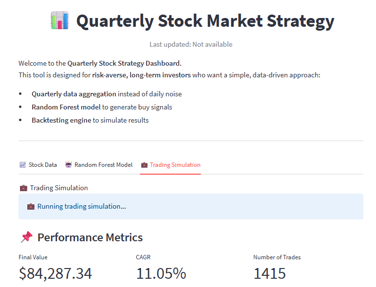

# 📈 Quarterly Stock Market Strategy

**Tags:** `Finance` `Machine Learning` `Stock Market` `Backtesting` `Automation` `Streamlit`  
**Technologies:** Python · Scikit-learn · Streamlit · GitHub Actions

## 🌟 Introduction

Despite the abundance of freely available financial information, many
people keep their savings idle in bank accounts with very low interest
rates.\
A large group is **risk-averse**: they fear losing money, and the
complexity of daily market monitoring discourages them from investing at
all.

This project explores whether **low-frequency investing** ---
rebalancing quarterly into low- to medium-risk stocks --- can be a safer
and less overwhelming alternative.\
In other words: *can "lazy" investors still achieve meaningful returns
without daily trading?*

This project was developed as part of the **DataTalksClub -- Stock
Market Analytics course**.

Check out **[Streamlit Dashboard](https://stockmarketproject.streamlit.app/)** to see the visualisations of stock
prices, prediction model and trading simulation.





------------------------------------------------------------------------

## 🏗️ Project Structure
  
    project-root/
    │
    ├── main.py                 # Main entry point – runs the full pipeline and Streamlit dashboard app
    ├── automation.py           # Monthly automation script (GitHub Actions entrypoint)
    ├── .github/workflows/      # GitHub Actions automation (monthly updates)
    ├── config.yaml             # User configuration (dates, tickers, parameters)
    ├── config_loader.py        # Loads config.yaml for use in scripts
    ├── requirements.txt        # Python dependencies
    ├── .gitignore              # Git ignore file
    │
    ├── notebooks/              # Initial exploration & prototyping
    │   ├── data_extraction.ipynb
    │   ├── model.ipynb
    │   └── simulation.ipynb
    │
    ├── scripts/                # Core logic (productionized from notebooks)
    │   ├── data.py             # Data extraction & feature engineering
    │   ├── model.py            # Machine learning pipeline (Random Forest)
    │   └── simulation.py       # Backtesting and portfolio simulation
    │
    ├── images/                 # Dashboard screenshots
    └── data/                   # Output data & results (created at runtime)
        ├── quarterly_data.csv
        ├── rf_model_pred.csv
        ├── portfolio_history.csv
        ├── trades.csv
        └── metrics.json

------------------------------------------------------------------------

## ⚙️ Automation (GitHub Actions)

The project includes **monthly automation** to:  
- Run pipeline on the **last day of the month**  
- Refresh data (if `LOAD_DATA=True`)  
- Retrain model (if `TRAIN_MODEL=True`)  
- Run backtest & save updated results  

Workflow defined in: `.github/workflows/monthly_update.yml`  

### Example run log:
```
LOAD_DATA=False | TRAIN_MODEL=False | RUN_SIMULATION=True
Loaded quarterly_data.csv (cached)
Skipped model training (using rf_model_pred.csv)
Backtest executed → updated portfolio_history.csv, trades.csv, metrics.csv
```

------------------------------------------------------------------------

## ⚙️ Workflow

The project runs as a **three-stage pipeline**:

1.  **Data Preparation** (`scripts/data.py`)
    -   Extracts **price features** (quarterly aggregates of daily stock
        data from Yahoo Finance)\
    -   Pulls **fundamental features** (valuation ratios, debt metrics,
        ESG, earnings)\
    -   Joins with **macro indicators** (FRED series, market ETFs)\
    -   Saves a **quarterly dataset** to `Data/quarterly_data.csv`
2.  **Model Training & Prediction** (`scripts/model.py`)
    -   Defines categorical variables & target (`buy_signal`)\
    -   Encodes categorical features (tickers, sectors)\
    -   Splits data chronologically (80% train / 20% test)\
    -   Trains a **RandomForestClassifier** with **TimeSeriesSplit
        cross-validation**\
    -   Saves best model and creates predictions →
        `Data/rf_model_pred.csv`
3.  **Trading Simulation** (`scripts/simulation.py`)
    -   Runs a backtest with fixed capital allocation\
    -   Applies stop-loss and take-profit thresholds\
    -   Computes metrics: **final value, CAGR, number of trades**\
    -   Optionally tunes parameters over a grid of stop-loss /
        take-profit combinations\
    -   Saves portfolio history and trades → `Data/simulation.csv`

The **main pipeline** (`main.py`) runs all three steps automatically.

------------------------------------------------------------------------

## ▶️ How to Run

### 1. Clone the repository

``` bash
git clone https://github.com/<your-username>/<your-repo>.git
cd <your-repo>
```

### 2. Set up environment

``` bash
python -m venv venv
source venv/bin/activate   # (Linux/Mac)
venv\Scripts\activate      # (Windows)

pip install -r requirements.txt
```

### 3. Configure

Edit (if needed) **`config.yaml`** to set: - `START_DATE`, `END_DATE` (historical
data range)\
- `TICKERS_LIST` (portfolio tickers)\
- `INITIAL_CAPITAL`, `TRANSACTION_FEE`, `STOP_LOSS_PCT`,
`TAKE_PROFIT_PCT`

### 4. Run pipeline

``` bash
streamlit run main.py
```
### 5. GitHub Actions (optional)

This workflow runs automatically on schedule.  
If you'd like to run manually:

```bash
python automation.py
```


This will: - Download and process financial data\
- Train a Random Forest model\
- Run trading simulation\
- Save all results into the `Data/` folder\
- Generate a Streamlit Dashboard with visuals and KPIs
- Run an automated update

------------------------------------------------------------------------

## 📊 Example Outputs

-   `quarterly_data.csv`: Engineered dataset (features per
    ticker/quarter)\
-   `rf_model_pred.csv`: Model predictions (buy/hold signals)\
-   `portfolio_history.csv`: Portfolio performance history
-   `trades.csv`: Trades done bae´sed on the trading strategy
-   `metrics.json`: Trading strategy performance

------------------------------------------------------------------------

## 💡 Notes

-   **Logging:** All scripts use Python's `logging` module for
    structured output.\
-   **Reproducibility:** Raw data comes from Yahoo Finance & FRED APIs
    --- results may differ if re-run at different times.\
-   **Notebooks:** The original exploratory analysis is preserved in
    `notebooks/`, while production code lives in `scripts/`.
